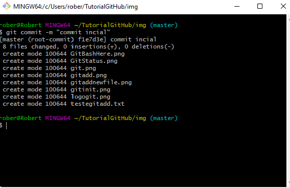
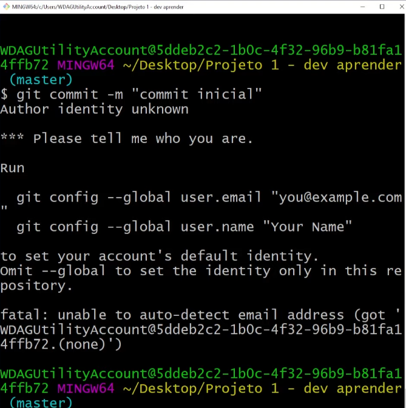

# 【🗃️】**Summary of commands**

[CLIQUE AQUI PARA CONTINUAR O TUTORIAL 🎥](https://www.youtube.com/watch?v=ZUfFxkU1aSg)

```bash
#Boot and create a .git folder
$ git init
```
```bash
$ git add "name files"
```

<center><p><b>or</b></p></center>

```bash
# To add all files
$ git add .
```
```bash
$ git commit -m "name the commit"
```
```bash
#To change the branch from master to main
$ git branch -m master main
```

<center><p><b>or</b></p></center>

```bash
#To change the branch from main to master
$ git branch -m main master
```
[CLIQUE AQUI PARA CONTINUAR O TUTORIAL 🎥](https://www.youtube.com/watch?v=Kk9ZuXGhHMs)

```bash
#Paste the repository link into the url
$ git remote add origin <url>
```
```bash
#is a method of combining your local unpublished changes with the latest published changes on your remote
$ git pull --rebase origin main
```
```bash
#push all the branches, whatever you have configured or committed to push from your repo
$ git push -u origin main
```
```bash
#sets the branch you are pushing to as the remote tracking branch of the branch you are pushing
$ git push --set-upstream origin main
```

# 【⚡️】**Commands for using GIT**

<h1 text-align="center">
    </img>
    <p><b>Tutorial on how to use Git !!🟠</b></p>
</h1>

## 【🗃️】**How to initialize a repository**
</br>

## 🔴 **Git Bash here**

* Open your folder that you want to export stop the repositorio, right click and go on **GitBash Here**

<center>
    
</center>

## 🟡 **Terminal Git**

* He's going to open a terminal, this **terminal** is going to be **Git**,and this is where we start giving commands

<center>
    
</center>

## 🟢 **Git init**

* First commands we'll give is **git init**, The **git init command creates a new Git repository**. It can be used to convert an existing, unversioned project to a Git repository or initialize a new empty repository.

~~~bash
$ git init
~~~
<center>
    
</center>

## ⚠️ Don't touch the **.git** folder

## 🔵 **Git status**

~~~bash
#To find out if your repositorio is updated, type **git status**
$ git status
~~~

* Here's going to be a report that were included in version control, and which ones were included in version control

<center>
    
</center>

* In the **terminal says there was no commit**, there was no **version of the code**

#
# 【📱】 How to add files in version control

## 🟤 **Git add**

~~~bash
#To add the file in version control just type git add "name the file"
$ git add "name the file"
~~~

<center>
    </img>
</center>

* This file has just been **added to version control**

<center>
    </img>
</center>

```bash
# To add two or more files to your project, just type git add.
$ git add .
```

<center>
    
</center>

* Now all the files that were in the folder have been added

#
# 【🚚】How to create versions of code with commit

## 🟢 **Git commit**

* So with the added files let's create the first version by typing the command **git commit -m *"message to represent what was done in the version"**

~~~bash
$ git commit -m "commit inicial"
~~~

<center>
    </img>
</center>


</br>

## ⚪ **Git config --global user.email "you@example.com"** and **Git config --global user.email "Your name"**

* ⚠️ For you who are doing this for the first time, will open to enter your email and your name

<center>
    </img>
</center>

* For you who are doing this for the first time, will open to enter your email and your name

```bash
$ git config --global user.email "you@example.com"
```

```bash
$ git config --global user.email "Your name"
```

<center>
    </img>
</center>

</br>

* Again type the command **git commit -m "commit inicial"**

</br>

~~~bash
$ git commit -m "commit inicial"
~~~

</br>

* We have created a new commit, with the files for a new **branch**, these files go to the cloud where our repositories are located.

<center>
    
</center>

#
# 【📦️】How to send changes using git push

## 🟣 Git push

* The **git push** is used to place the files in the cloud, the ones you committed

```bash 
$ git push
```
<center>
    </img>
</center>

</br>

* For this, you need to create a repository in **Github**, once already created, you will copy and paste the link from the repository

</br>


</br>

* After copying the link from the repository, paste in the following command

## ⚪ Git remote add 

* Paste the link you copied from the repository in **git remote add**

```bash
$ git remote add <name> <url>
```

</br>

<center>
    
</center>

</br>

## ⚫ Git branch -m master main or Git branch -m main master

* Both of these two serve to change the **branch of the repositorio**

```bash
$ git branch -m master main
```

</br>

<center>
    </img>
</center>

</br>

## 🔷 Git pull

* Search for and integrate with another repository or a local branch

```bash
$ git pull --rebase origin main
```

</br>

<center>
    </img>
</center>

</br>

## 🟥 Git push -u

* By default, Git chooses origin for the remote and your current branch as the branch to push. If your current branch is main, the command git push will supply the two default parameters—effectively running git push origin main. In the example below, the origin remote is a GitHub repository, and the current branch is main

```bash
$ git push -u origin main 
```
<center>
    </img>
</center>

</br>

## 🟩 Git push --set-upstream origin main

* When you set your upstream (or tracking) branches, you can simply execute pulls and pushes without having to specify the target branch. Git automatically knows that it has to fetch the new commits to the remote tracking branch.

```bash
$ git push --set-upstream origin main
```

</br>

<center>
    </img>
</center>

</br>

#
#  【👔】Finish, Now just just refresh the page and it will be there 😁😁😁

<center>
    
</center>

